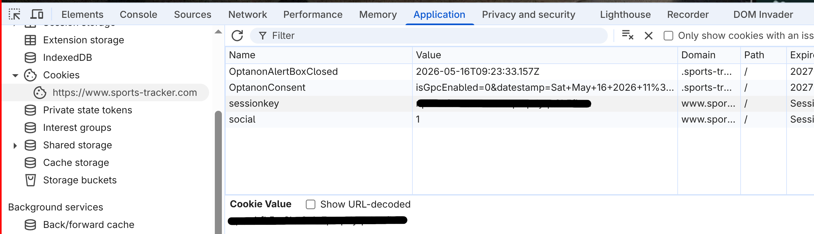

# Sports Tracker GPX Export
Export all your workouts in `*.gpx` format.

## Setup
- [Install uv](https://docs.astral.sh/uv/getting-started/installation/)
- Open a browser, go to [Sports Tracker](https://www.sports-tracker.com/login), and log in.
- Press F12 to open developer option. Navigate to Cookies and copy your session key.

- Paste the session key into a file called `secret.txt` into this repository.
- Run `uv run src/sportstracker_export.py`
- If successful, all your workouts are exported to `export`

